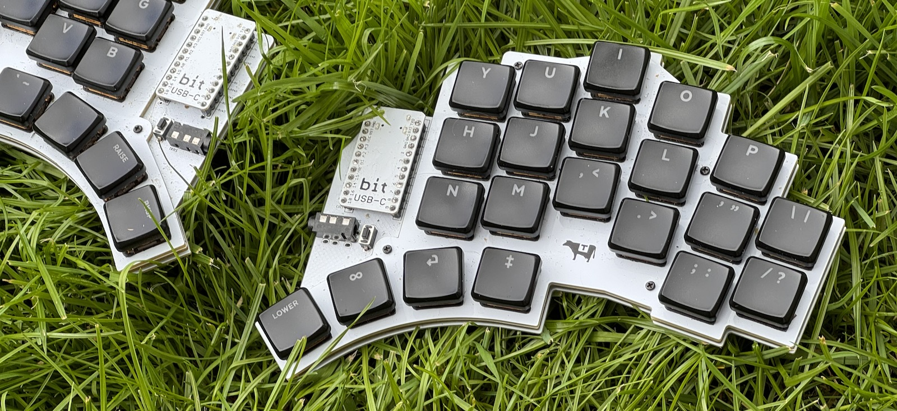

# The Missing Keyboard

A minimal, opinionated, column-staggered 42 key split keyboard based on
the [KLOR](https://github.com/GEIGEIGEIST/KLOR).

- QMK firmware with developer-focused QWERTY and COLMAK layouts.
- Home row mods.
- Per-key RGB matrix.
- Minimal 3-board construction.
- Choc v1 hotswap (or soldered KS-27*)

It has the same staggered key layout as KLOR, but with a smaller
footprint.

## Extra Layers

- LOWER Numeric keypad.
- UPPER Shifted top-row numbers, arrows and brackets.
- LOWER + UPPER Switch layout.

## Parts

Aside from the PCBs, you'll most likely need:

- 42 Choc v1 hotswap (or KS-27*) sockets + key switches.
- 2x ProMicro ATmega32U4 or compatible MCUs (machine pin sockets
  recommended).
- 42x SK6812 Mini LED (not Mini-E) 3535 size.
- 2x PTS636 reset switches.
- 2x TRRS 3.5mm jack sockets (MJ-4PP-9 or PJ320A).
- 1x TRRS cable.
- 8x M2 Standoffs (4mm for choc).
- 8x M2 screws (3mm for choc).
- 8x Sticky feet.

> Note:
> This is my first build, so please double-check parts and quantities
> before ordering in case I messed anything up!

## Build

You should hopefully be able to follow the original KLOR [Build
Guide](https://github.com/GEIGEIGEIST/KLOR/blob/main/docs/buildguide_3DP.md),
omitting the removed components.

The main difference is that with the stacked PCB build, you'll probably
want to mount the MCUs **upside down** on the **top** of the board (see
picture). Especially if you're socketing it.

### Assembly

Once the main board is fully soldered, stack the switch plate on
top, and push the key switches through into the sockets on the
back of the main board. You can then screw the stand-offs to this,
before putting the backplate PCB on the bottom.

## Thanks

Many thanks to [@GEIGEIGEIST](https://github.com/GEIGEIGEIST/KLOR) for
the original design, and
[@sadekbaroudi](https://github.com/sadekbaroudi/KLOR) for the choc
version.

----
*I've only ever built this with chocs.
